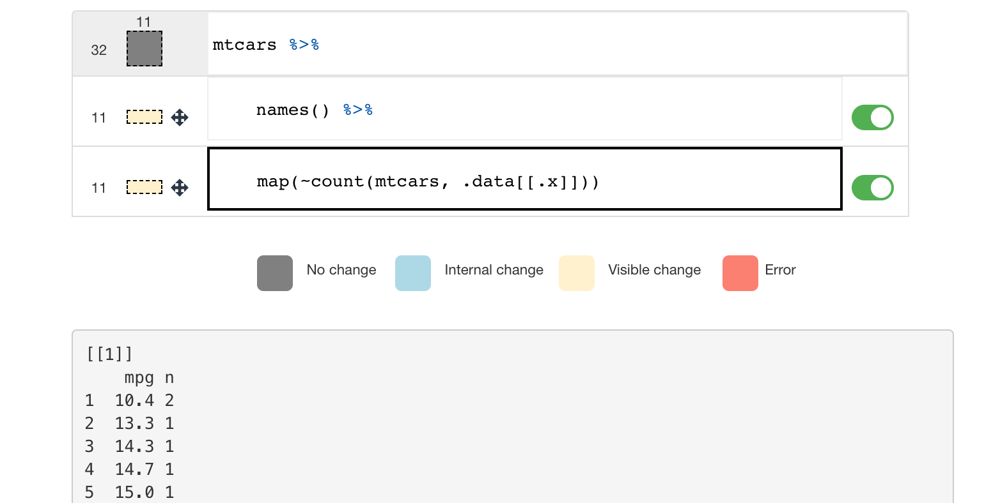
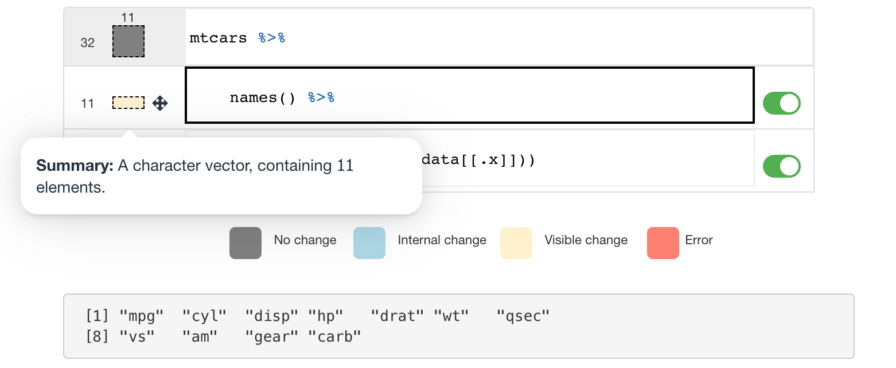

# Unravel: A fluent code explorer for R. 

> Unravel, inspect, and explore fluent code in R.

<!-- badges: start -->

[](https://www.tidyverse.org/lifecycle/#experimental)

<!-- badges: end -->

Unravel is an R package / Addin designed to help data scientists understand and explore tidyverse R code which makes use of the fluent interface (function composition via pipes). You can read about the tool in my [paper](http://nischalshrestha.me/docs/unravel.pdf) which covers its motivation, design, and results of a user study. Optionally, you can watch the [talk](https://youtu.be/wJ77e39XVEs) I gave at UIST 2021.

**NOTE:** The package is early on in its lifecycle and is still undergoing development. But, you can install it with:

```r
# install.packages('devtools')
devtools::install_github('nischalshrestha/Unravel')
```

# Usage

With Unravel, you can unravel `dplyr` or `tidyr` code which opens up a Shiny app in RStudio. You can then click on the lines to **inspect the intermediate outputs** (typically dataframes) of the tidyverse code. Both the code and output will be highlighted according to what type of **changes occurred** (no change, visible change, internal change, error).

Unravel also produces **automated function summaries** accessed through the dataframe box. Each function summary (if supported --- see [below](#what-verbs-have-summaries)) describe how the function transformed the previous dataframe in terms of dimensions (shape), whether or not changes were visible or internal (for e.g. grouping).

You can also **perform structural edits** to the code via toggles (comment/uncomment), and reordering lines with drag and drop interactions.

### RStudio IDE

The easiest way to use Unravel is to highlight the tidyverse code you want to unravel, then go to Addins -\> Unravel code.

<p align="center">
  
</p>

This will open up the app on the Viewer pane in RStudio by default. If you want to respect your currently chosen browser window, you can pass `viewer = FALSE` using the programmatic way shown below.

This style of coding always involves starting with a source of data. So, the first expression or line is "locked" such that you can't enable/disable or reorder it and other operations can't be reordered before the first line (as shown at the end of the GIF above).

You can also invoke it programmatically using the `unravel` function by wrapping or piping your code to the function:

```r
# wrapped
Unravel::unravel(
  mtcars %>%
    group_by(cyl) %>% 
    summarise(mean_mpg = mean(mpg))
)
# piped
mtcars %>%
  group_by(cyl) %>% 
  summarise(mean_mpg = mean(mpg)) %>%
  Unravel::unravel()
```

### Other data types

It's also possible to unravel code where steps may produce non-dataframe outputs such as lists or vectors. For example, if we unravel the following code:

```r
mtcars %>%
  names() %>%
  map(~ count(mtcars, .data[[.x]]))
```

The UI now visualizes list/vectors as a slimmer, wider rectangle with only its length reported on the left:



The summaries for lists currently only report the number of elements, but in the future will include more details especially as we add support for `{purrr}` functions.




### Chain outputs

You can also programmatically collect the intermediate outputs of the tidyverse code into a list structure with `get_chain_outputs`:

```r
get_chain_outputs(rlang::expr(
  mtcars %>%
    group_by(cyl) %>% 
    summarise(mean_mpg = mean(mpg))
))
```

which returns:

    [[1]]
                         mpg cyl  disp  hp drat    wt  qsec vs am gear carb
    Mazda RX4           21.0   6 160.0 110 3.90 2.620 16.46  0  1    4    4
    Mazda RX4 Wag       21.0   6 160.0 110 3.90 2.875 17.02  0  1    4    4
    Datsun 710          22.8   4 108.0  93 3.85 2.320 18.61  1  1    4    1
    Hornet 4 Drive      21.4   6 258.0 110 3.08 3.215 19.44  1  0    3    1
    Hornet Sportabout   18.7   8 360.0 175 3.15 3.440 17.02  0  0    3    2
    Valiant             18.1   6 225.0 105 2.76 3.460 20.22  1  0    3    1
    ...

    [[2]]
    # A tibble: 32 x 11
    # Groups:   cyl [3]
         mpg   cyl  disp    hp  drat    wt  qsec    vs    am  gear  carb
       <dbl> <dbl> <dbl> <dbl> <dbl> <dbl> <dbl> <dbl> <dbl> <dbl> <dbl>
     1  21       6  160    110  3.9   2.62  16.5     0     1     4     4
     2  21       6  160    110  3.9   2.88  17.0     0     1     4     4
     3  22.8     4  108     93  3.85  2.32  18.6     1     1     4     1
     4  21.4     6  258    110  3.08  3.22  19.4     1     0     3     1
     5  18.7     8  360    175  3.15  3.44  17.0     0     0     3     2
     6  18.1     6  225    105  2.76  3.46  20.2     1     0     3     1
    ...

    [[3]]
    # A tibble: 3 x 2
        cyl mean_mpg
      <dbl>    <dbl>
    1     4     26.7
    2     6     19.7
    3     8     15.1

### What verbs have summaries?

Currently, any `dplyr`/`tidyr` piped code working on single tables will work execution-wise, but only a handful of the functions in each package has explicit support for summaries / has been tested. The summaries are generated by an [extension](https://github.com/nischalshrestha/tidylog) package of the amazing original [tidylog](https://github.com/elbersb/tidylog) package.

In the extension, I have added some enhancements (like data shape summary for every verb and rephrasing summaries) and is specially designed to work with `Unravel` so that I can access the messages in a convenient cache. All verbs supported by `tidylog` besides `join`s will work and some more I added like `arrange`, `rowwise`.

## Performance limitations

Unravel currently starts to lag when handling dataframes that are larger than 100K rows. In the future, I will find ways to optimize the app so it can startup and respond faster for larger datasets. However, at this time try using Unravel for smaller datasets or work on subsets since the tool is more geared towards learning the tidyverse rather than a super scalable tool that is used in 'production' systems.

# Contributions

Currently Unravel is only maintained by me, and that means limited capacity to reliably maintain and evolve the project. So, please feel free to open up issues, and suggest changes to improve Unravel!

Please note that the Unravel project is released with a [Contributor Code of Conduct](https://github.com/nischalshrestha/Unravel/blob/main/CODE_OF_CONDUCT.md). By contributing to this project, you agree to abide by its terms.

# Related tools

There are several other similar tools that provide inspection and/or summary of tidyverse code operations and intermediates, which you may find useful as well:

-   [tidylog](https://github.com/elbersb/tidylog): a drop-in solution that logs summaries of steps through `message()` on console output
-   [ViewPipeSteps](https://github.com/daranzolin/ViewPipeSteps): an RStudio Addin that opens up tabs of intermediate outputs
-   [breakerofchains](https://github.com/MilesMcBain/breakerofchains): an RStudio/VSCode Addin that allows inspection of steps through cursor placement in editor
-   [datamations](https://github.com/microsoft/datamations): a framework to generate and visualize pipeline steps through explanations/animations
-   [Tidy Data Tutor](https://tidydatatutor.com): visualizations of tidyverse code focusing on visualizing how each step transforms dataframes
